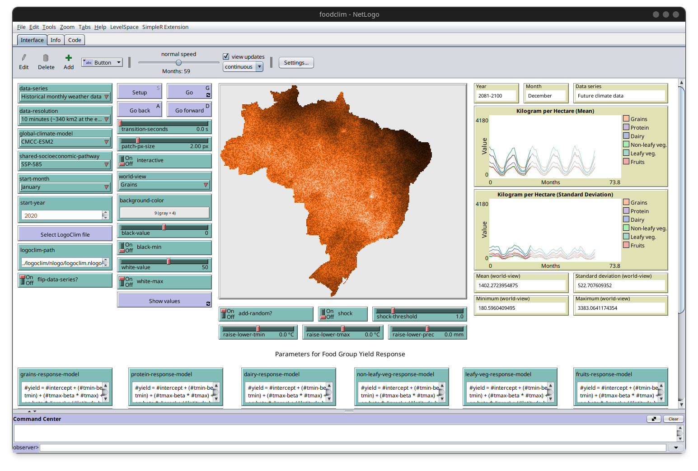

# foodclim

<!-- quarto render -->

<!-- badges: start -->
[](https://www.repostatus.org/#wip)
[](https://www.comses.net/)
[](https://doi.org/10.17605/OSF.IO/ZGVMP)
[](https://bestpractices.coreinfrastructure.org/)
[](https://choosealicense.com/licenses/mit/)
[](CODE_OF_CONDUCT.md)
<!-- badges: end -->

## Overview

`FoodClim` is a [NetLogo](https://ccl.northwestern.edu/netlogo/) model
designed to simulate how food yield responds to different climate
conditions. It aims to support empirically-based agent-based models
(ABM) on food systems and enhance the reproducibility of their
simulations.

The model runs in paralel with the
[`LogoClim`](https://github.com/sustentarea/logoclim) model, which
provides climate data from [WorldClim 2.1](https://worldclim.org/).

> If you find this project useful, please consider giving it a star!  
> [](https://github.com/sustentarea/foodclim/)



## How to Use It

Refer to the [`LogoClim`](https://github.com/sustentarea/logoclim)
installation guide for detailed steps on installing the required
dependencies.

Once `LogoClim` is installed, you can run the `FoodClim` model by
specifying the path to your `LogoClim` installation in the `FoodClim`
interface. This allows `FoodClim` to access climate data provided by
`LogoClim` during simulations.

Refer to the `Info` tab in the model for additional details.

## How to Cite

If you use this model in your research, please cite it to acknowledge
the effort invested in its development and maintenance. Your citation
helps support the ongoing improvement of the model.

To cite `FoodClim` in publications please use the following format:

Vartanian, D., & Carvalho, A. M. (2025). *FoodClim: Simulating food
yield responses to climate change in NetLogo* \[Computer software,
NetLogo model\]. <https://doi.org/10.17605/OSF.IO/ZGVMP>

A BibTeX entry for LaTeX users is:

``` latex
@Misc{vartanian2025,
  title = {FoodClim: Simulating food yield responses to climate change in NetLogo},
  author = {{Daniel Vartanian} and {Aline Martins de Carvalho}},
  year = {2025},
  doi = {https://doi.org/10.17605/OSF.IO/ZGVMP},
  note = {NetLogo model}
}
```

## How to Contribute

[](CODE_OF_CONDUCT.md)

Contributions are welcome! Whether it’s reporting bugs, suggesting
features, or improving documentation, your input is valuable.

[](https://github.com/sponsors/danielvartan)

You can also support the development of `FoodClim` by becoming a
sponsor. Click [here](https://github.com/sponsors/danielvartan) to make
a donation. Please mention `FoodClim` in your donation message.

## License

[](https://choosealicense.com/licenses/mit/)

`FoodClim` code is licensed under the [MIT
License](https://opensource.org/license/mit). This means you can use,
modify, and distribute the code freely, as long as you include the
original license and copyright notice in any copies or substantial
portions of the software.

## Acknowledgments

We gratefully acknowledge the contributions of [Stephen E.
Fick](https://orcid.org/0000-0002-3548-6966), [Robert J.
Hijmans](https://orcid.org/0000-0001-5872-2872), and the entire
[WorldClim](https://worldclim.org/) team for their dedication to
creating and maintaining the WorldClim datasets. Their work has been
instrumental in enabling researchers and practitioners to access
high-quality climate data.

We also acknowledge the World Climate Research Programme
([WCRP](https://www.wcrp-climate.org/)), which, through its Working
Group on Coupled Modelling, coordinated and promoted the Coupled Model
Intercomparison Project Phase 6
([CMIP6](https://pcmdi.llnl.gov/CMIP6/)).

We thank the climate modeling groups for producing and sharing their
model outputs, the Earth System Grid Federation
([ESGF](https://esgf.llnl.gov/)) for archiving and providing access to
the data, and the many funding agencies that support CMIP6 and ESGF.

<table>
  <tr>
    <td width="30%">
      <br/>
      <br/>
      <p align="center">
        <a href="https://www.fsp.usp.br/sustentarea/">
          
        </a>
      </p>
      <br/>
    </td>
    <td width="70%">
      <p>
        <code>LogoClim</code>
        was developed with support from the Research and 
        Extension Center 
        <a href="https://www.fsp.usp.br/sustentarea/">Sustentarea</a>
         at the University of São Paulo (<a href="https://www5.usp.br/">USP</a>).
      </p>
    </td>
  </tr>
</table>

<table>
  <tr>
    <td width="30%">
      <br/>
      <p align="center">
        <a href="https://www.gov.br/cnpq/">
          
        </a>
      </p>
      <br/>
    </td>
    <td width="70%">
      <p>
        This project was supported by the Conselho Nacional de 
        Desenvolvimento Científico e Tecnológico - Brazil (<a href="https://www.gov.br/cnpq/">CNPq</a>).
      </p>
    </td>
  </tr>
</table>
